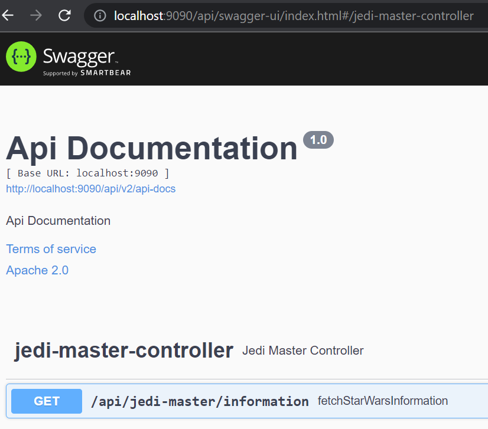
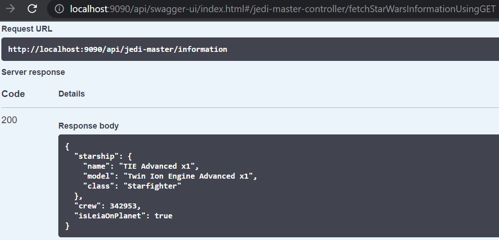

# Jedi Master API Application

## Table of Contents
- [About the Project](#about-the-project)
- [Technologies Used](#technologies-used)
- [Prerequisites](#prerequisites)
- [How to run](#how-to-run)
- [Swagger UI](#swagger-ui)
- [API Endpoints](#api-endpoints)
- [Testing](#testing)
- [References](#references)

## About the Project
Jedi Master API application is a Spring Boot application that allows you to retrieve information about the Star Wars 
universe from Swapi API https://swapi.dev/. 
The API can be used to find out what starship Darth Vader is using, the number of crews on board the Death Star, and 
whether Princess Leia is on the planet Alderaan.

## Technologies Used
* Java 8, Spring Boot 2.7.11, Maven, Log4j2 
* Springfox Swagger, Lombok, Powermock and Junit

## Prerequisites
* Java 8 or higher
* Maven

## How to run
* Clone the repository using ```$ git clone git@github.com:senthilmurugangsm/jedi-master-api.git```
* Open the project in your IDE of choice.
* Navigate to directory ```/jedi-master-api``` and run command ```mvn spring-boot:run``` to start the application 
or run using main class ```JediMasterApiApplication.java```<br/>
* Once the application has started, you can access the Swagger UI by navigating to http://localhost:9090/api/swagger-ui/index.html.

## Swagger UI
The API documentation can be accessible using Swagger link http://localhost:9090/api/swagger-ui/index.html. <br/>



## API Endpoints
The Jedi Master API has a request url http://localhost:9090/api/jedi-master/information and endpoint as below. <br/>

```GET /api/jedi-master/information```
<br/>

This endpoint retrieves the below information the describes, <br/>

```startship``` - Starship that Darth Vader is using. <br/>
```crew``` - Number of crews on board the Death Star. <br/>
```isLeiaOnPlanet``` - Whether Princess Leia is living on planet Alderaan.

### Response:
Refer the below sample response for this endpoint. <br/>




## Testing
The Jedi Master API includes unit tests as well. To run the tests, 
use the following command; <br/>

```mvn test```

## References
Swapi API - https://swapi.dev/ <br/>
Swapi API documentation - https://swapi.dev/documentation
